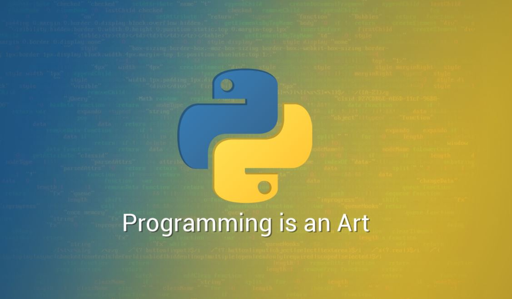

<!--  -->
<kbd></kbd>

    
# PYTHON PROGRAMMING
 -  THIS IS MY PYTHON REPOSITORY WHERE YOU CAN FIND A LOT OF PROGRAMS ON PYTHON.
# LICENSE

# Authors

- [@Manmay Chakraborty](https://www.github.com/manmay2)

 
